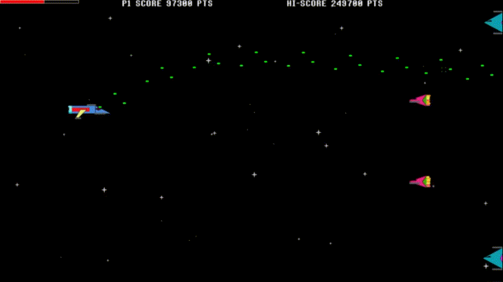

## Лабораторная работа № 2

Framework'и/библиотеки: только стандартные обертки 
Окружение: Chrome, Mozilla последних ревизий (должна быть возможность игры с телефона)

### Задача
Создать игру в стиле *side scrolling shooter*, на подобии уровней с самолетом из cuphead.

### Различные критерии:
- Игра должна быть в реальном времени (для постоянного обновления )
- Должно быть игровое меню входа:
  - При входе выбирается тип управления
    - Клавиатура/мышь:
        - стрельба происходит только при нажатии клавиши стрельбы
    - Через нажатия (мышкой/тачами по экрану):
        - стрельба происходит в автоматическом режиме
  - После выбора управления начинается игра
- Должно быть меню проигрыша (или победы), из которого можно попасть в меню входа без перезагрузки страницы
- Снаряды должны лететь только в прямом направлении
- У игрока должны быть жизни
- Сразу после получения урона игрок входит в режим бессмертия на несколько секунд
- Уровень может быть бесконечным или конечным, но с боссом в конце (или в течение игры)
- В рамках задачи необходимо реализовать следующий перечень классов:
    - Player - класс игрока, в котором должны содержаться информация о количестве его здоровья
    - Obstacle - класс препятствия, при пересечении с которым игрок теряет здоровье и попадает в режим бессмертия на несколько секунд
    - Enemy - класс рядового противника, наносящего урон игроку (аналогичен Obstacle, но не является его наследником)
    - Bullet - класс снаряда, который выпускается игроком (и, возможно, противниками)
      - снаряды игрока не должны наносить ему урон. 
- Дополнительные классы создавать не запрещается!
- Должен быть счетчик опыта (или монет/времени), характеризующие прогресс игрока
  - Прогресс должен доступен на протяжении всего сеанса игры (в том числе и в меню входа/проигрыша (победы))

#### Условия
- Возможно использовать для отрисовки обертку [canvas](https://developer.mozilla.org/ru/docs/Web/API/Canvas_API/Tutorial)
- Текстуры можете брать по своему усмотрению
- Не выгружать файлы одним коммитом
- Игра должна быть доступна через github pages
